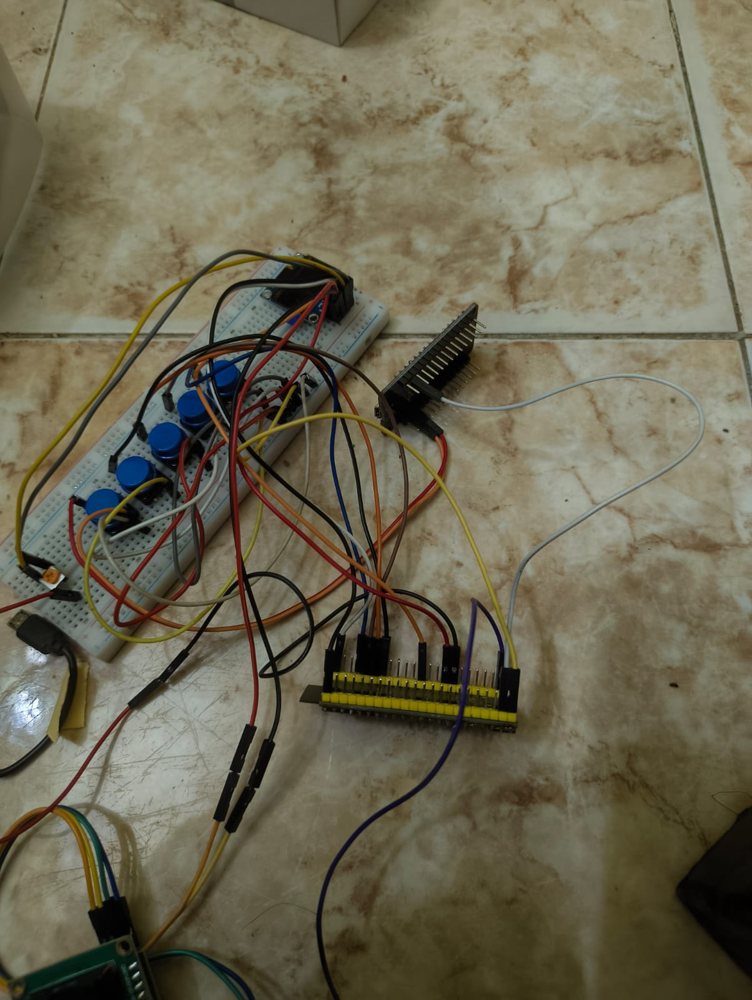
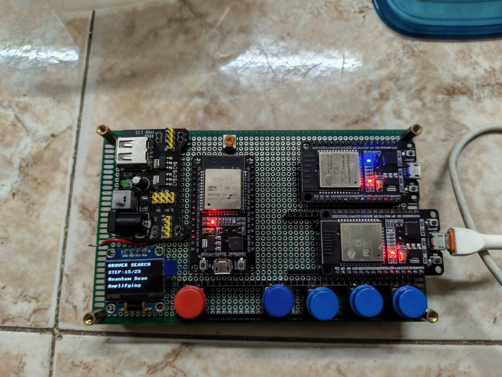

# TRI-32: BB84-Inspired Quantum Key Distribution Testbed

**Hardware-Based Quantum Key Distribution Emulation with Edge AI Anomaly Detection for Secure Genomic Data Analysis**

TRI-32 is an ESP32-based educational testbed that demonstrates BB84-inspired Quantum Key Distribution (QKD), simulated eavesdropping, QBER monitoring, and lightweight edge anomaly detection. The system uses three ESP32 nodes representing Alice, Bob, and Eve, together with OLED displays and a real-time dashboard.

## Hardware Demonstration



*TRI-32 prototype with ESP32 boards, OLED display, push buttons, and supporting circuitry.*



*Physical arrangement of the three-node embedded testbed.*

## Project Objectives

- Demonstrate BB84-inspired key exchange using ESP32 hardware.
- Implement Alice, Bob, and Eve as separate embedded nodes.
- Monitor Quantum Bit Error Rate (QBER).
- Detect abnormal QBER behaviour using a Z-score-based anomaly detector.
- Display system status and security alerts.
- Demonstrate genomic mutation searching using classical search and a Grover-search approximation.

## System Architecture

```text
        ALICE NODE
     ESP32 + MicroPython
             |
             | ESP-NOW
             v
         BOB NODE
     ESP32 + MicroPython
             |
             v
       QBER MONITORING
             |
             v
    Z-SCORE ANOMALY DETECTION
             |
       +-----+------+
       |            |
       v            v
    NORMAL       ANOMALY
  OPERATION      DETECTED
                    |
                    v
             SECURITY ALERT

          EVE NODE
   Simulated Interception

       OLED + DASHBOARD
   Status | QBER | Alerts
```

*This diagram describes the conceptual workflow of the educational prototype.*

## Hardware Components

| Component | Purpose |
|---|---|
| ESP32 DevKit V1 | Alice, Bob, and Eve nodes |
| OLED display | Local status and protocol progress |
| Push buttons | Trigger operations and select modes |
| Potentiometer | Adjust interception intensity |
| LEDs | Status and security indication |
| Laptop dashboard | Real-time system monitoring |

## Software and Technologies

- MicroPython
- ESP32
- ESP-NOW wireless communication
- HTML
- CSS
- JavaScript
- Z-score-based anomaly detection

## BB84-Inspired Workflow

1. Alice generates random bits and selects random bases.
2. Bob selects measurement bases and receives the transmitted information.
3. Alice and Bob compare their bases.
4. Bits corresponding to matching bases are retained.
5. A shared demonstration key is generated.
6. QBER is monitored for abnormal changes.
7. Eve simulates interception and introduces errors into the modeled exchange.
8. The anomaly detector identifies unusual QBER behaviour and triggers a security response.

## Edge Anomaly Detection

The system uses a lightweight Z-score-based detector on the ESP32 to identify deviations in QBER without relying on cloud processing.

QBER is calculated as:

\[
QBER = \frac{\text{Incorrect Bits}}{\text{Total Compared Bits}}\times100
\]

When the configured anomaly threshold is exceeded, the prototype can generate a security alert, indicate channel locking, and discard the generated demonstration key.

## Genomic Data Search Demonstration

The project demonstrates searching for a target DNA mutation pattern using two approaches:

- **Classical search:** Sequential search with \(O(N)\) time complexity.
- **Grover-search approximation:** An educational illustration of the theoretical \(O(\sqrt{N})\) query-complexity concept.

This module is a software approximation and does not execute a quantum search on physical quantum hardware.

## Experimental Results

| Parameter | Reported result |
|---|---|
| Demonstration key length | 12 bits |
| Normal-operation QBER | 1–3% |
| Simulated Eve-attack QBER | 40–50% |
| BB84 exchange cycles | 5 |
| Dashboard updates | Real-time |
| Classical search complexity | \(O(N)\) |
| Grover-search approximation | \(O(\sqrt{N})\) |

*These are prototype demonstration results, not a certification of cryptographic security or physical quantum key distribution.*

## Video Demonstrations

### Video 1 — Hardware and BB84 Exchange

[Watch Video 1](assets/VIDEO_1_URL.mp4)

### Video 2 — Eve Attack and QBER Monitoring

[Watch Video 2](assets/VIDEO_2_URL (1) (1).mp4)

Replace `VIDEO_1_URL` and `VIDEO_2_URL` with your actual video URLs.

## Repository Structure

```text
TRI-32-Embedded-Quantum-Emulator/
├── Alice.py
├── bob.py
├── eve_reconstructed.py
├── README.md
└── assets/
    ├── tri32-hardware-1.jpg
    └── tri32-hardware-2.jpg
```

This is the suggested structure. Keep the actual filenames in your repository and add other files, such as dashboard assets, if applicable.

## Setup and Execution

1. Install compatible MicroPython firmware on the ESP32 boards.
2. Connect each ESP32 to your development computer.
3. Upload the corresponding firmware file to the Alice, Bob, and Eve nodes.
4. Configure the nodes according to the implemented ESP-NOW communication workflow.
5. Start the dashboard using the method supported by its implementation.
6. Observe key-generation status, QBER changes, and simulated interception alerts.

Exact upload commands and dashboard startup steps depend on your implementation.

## Limitations

- TRI-32 is a classical hardware emulation of BB84 concepts, not a physical quantum communication system.
- Eve represents a simulated interceptor.
- The demonstration key is not intended for production cryptographic use.
- The Grover-search comparison illustrates algorithmic concepts rather than physical quantum speedup.
- The prototype has not been established as secure against all real-world attacks.

## Future Improvements

- More rigorous QBER calculation and validation.
- Encrypted payload transmission.
- Improved dashboard analytics.
- Further experimentation with optical quantum communication hardware.

## Author

**B. Badhri Narayanan**  
Department of Electronics and Communication Engineering  
Rajalakshmi Engineering College, Chennai  
Academic Year: 2025–2026

---

*TRI-32 brings embedded systems, wireless communication, anomaly detection, and quantum communication concepts together in a physical educational testbed.*
